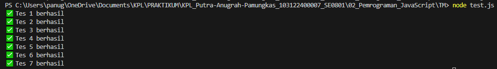

# Tugas Mandiri 02: Pemrograman JavaScript
## Soal  
Buatlah sebuah fungsi bernama fizzBuzz yang menerima input larik (array) dan mengembalikan deretan bilangan dan "Fizz" untuk kelipatan 2, "Buzz" untuk kelipatan 7, dan "FizzBuzz" untuk kelipatan 14.

## Kode Sumber
Tersedia di [tm.js](./tm.js)

## Output

## Deskripsi Program
Pada baris pertama, program ini memiliki fungsi yang akan mengecek apakah element-element arr yang dimasukkan benar-benar sebuah array menggunakan Array.isArray(arr). Kemudian, Jika di dalam array terdapat angka **1** atau **-1**, maka karakter pemisahnya adalah koma dan spasi **(", ")**. Jika tidak ada angka **1** atau **-1** sama sekali di dalam array, maka karakter pemisahnya hanyalah spasi **(" ")**. Selanjutnya program akan melakukan looping untuk memeriksa setiap angka di dalam array satu per satu, dengan prioritas **Kelipatan 14:** Jika angka habis dibagi 14 (angka % 14 == 0), maka angka tersebut diganti dengan teks **"FizzBuzz"**. (Catatan: 14 digunakan karena ia adalah Kelipatan Persekutuan Terkecil dari 2 dan 7). **Kelipatan 7:** Jika angka habis dibagi 7 (angka % 7 == 0), maka angka tersebut diganti dengan teks **"Buzz"**. **Kelipatan 2:** Jika angka habis dibagi 2 (angka % 2 == 0), maka angka tersebut diganti dengan teks **"Fizz"**. **Kondisi Lainnya**: Jika angka tidak memenuhi ketiga syarat di atas, maka angka tersebut tidak diubah dan hanya **diganti menjadi bentuk teks (string)**. Setiap kali satu angka selesai dihitung, hasilnya akan digabungkan ke dalam variabel bernama hasilAkhir.