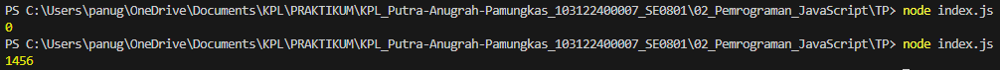

# Tugas Pendahuluan 02: Pemrograman JavaScript
## Soal  
Kamu sudah menulis fungsi mulOfArray. Ujilah dengan input [2, 0, 26, 28, -2], dengan output yang seharusnya adalah 1456. Jika kamu menemukan bahwa hasilnya berbeda, bisakah kamu memperbaikinya? Jika kamu menemukan bahwa hasilnya sama, bisakah kamu menjelaskan mengapa demikian?

## Jawaban 
Ketika pertama kali dicoba hasilnya adalah **0**, dan setelah saya teliti lebih dalam lagi terdapat permasalah di bagian if (arr[i] >= 0) dimana ketika program dijalankan maka ketika ada angka **0** didalam larik, itu akan ikut kedalam pengecualian yaitu if. Jadi **0** akan dikalikan dengan angka yang ada didalam variabel result dimana angka berapapun ketika dikalikan **0** maka hasilnya adalah **0**. Penyelesaiannya adalah menghilangkan **=** yang ada didalam if sehingga angka **0** yang ada didalam larik tidak akan mengakibatkan program if berjalan. Sehingga program akan menghasilkan output **1456**.

## Kode Sumber
Tersedia di [index.js](./index.js)

## Output

## Deskripsi Program
Program ini menjalankan perkalian semua bilangan positif dalam larik (array). Ini akan bekerja untuk bilangan positif, nol, dan negatif.

Ketika kita menjalankan program yang dimana diawal masih menggunakan if (arr[i] >= 0) akan menghasilkan angka **0**(jika ada 0 didalam larik), kita program ulang menjadi if (arr[i] > 0) dimana **0** tidak akan ikut kedalam if/tidak ikut terhitung, sehingga yang dihitung adalah hanya semua bilangan positif yang lebih besar daripada **0**.