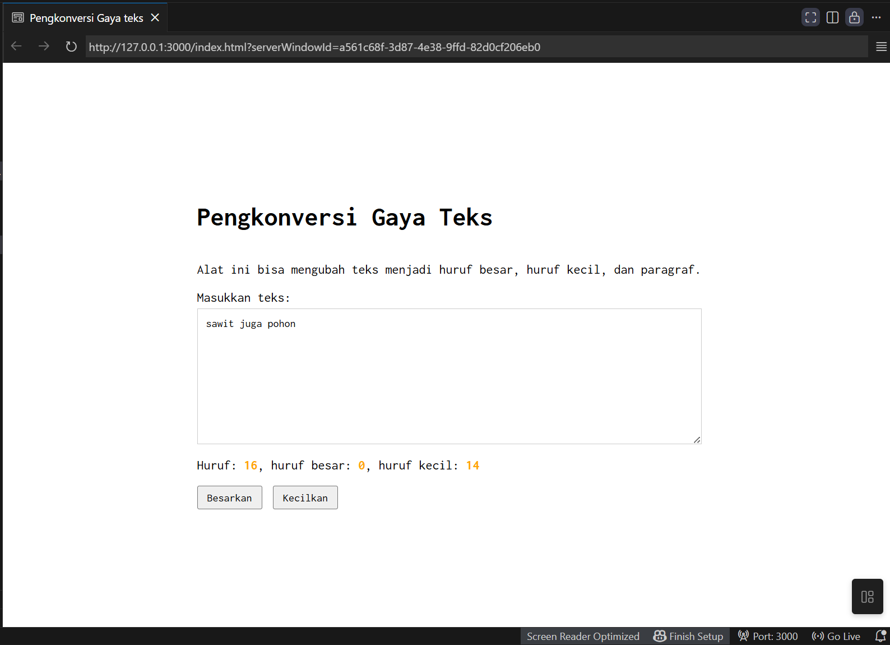
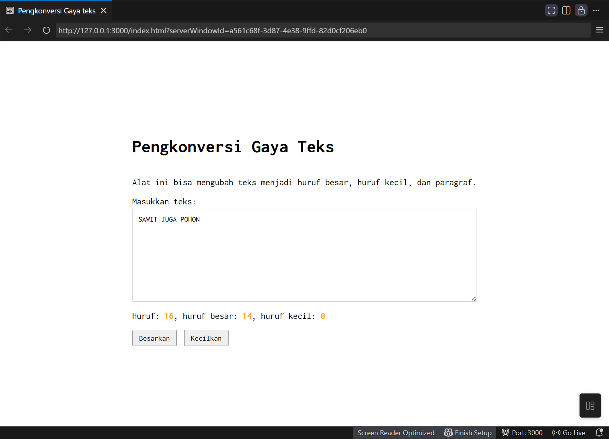

# Tugas Mandiri 03: GUI dengan HTML dan CSS

**Nama:** Putra Anugrah Pamungkas   
**NIM:** 103122400013  
**Kelas:** SE-08-01

## Tugas  
Setelah kamu menyelesaikan tugas pendahuluan, terapkanlah fungsi untuk (1) menghitung huruf kecil yang disediakan di #hk, (2) mengubah huruf kecil ke huruf besar ketika pengguna menekan tombol #huruf-besar, dan (3) mengubah huruf besar ke huruf kecil ketika pengguna menekan tombol #huruf-kecil

## Kode Sumber
Tersedia di [index.html](./index.html) 
Tersedia di [index.css](./index.css) 
Tersedia di [index.js](./index.js)

## Output

## Deskripsi Program
Program ini berfungsi untuk menghitung Huruf/karakter secara langsung. Jadi ketika kita mengetik, programnya bakal langsung ngecek dan ngasih tau total karakternya ada berapa. Terus, dirinci lagi ada berapa jumlah huruf besarnya dan huruf kecilnya. Tombol Ubah Huruf menjadi besar dan kecil yang berfungsi buat langsung ngubah semua teks yang udah diketik jadi HURUF BESAR atau huruf kecil semua. Abis diklik, angka hitungan hurufnya juga otomatis langsung update.
