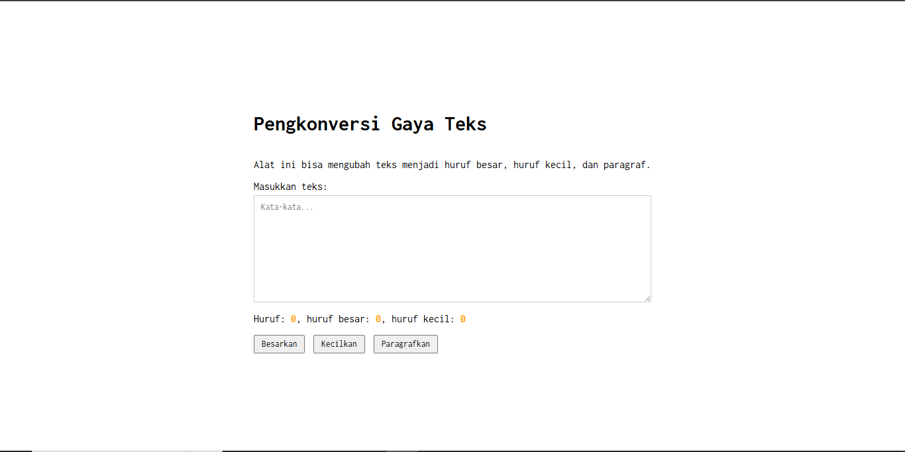

# Tugas Pendahuluan 03: GUI dengan HTML dan CSS
## Soal  
Buatlah tata letak laman yang kamu buat berada di tengah, dan juga ubah font-nya dengan Inconsolata dari Google Fonts.

## Kode Sumber
Tersedia di [index.html](./index.html)

## Output

## Deskripsi Program
Program ini menggunakan **HTML** untuk basenya, kemudian didesign menggunakan **CSS** dan menggunakan **JavaScript** untuk interaksi-interaksi didalamnya. Program ini berfungsi untuk mengubah format teks secara instan. Program ini memungkinkan pengguna untuk mengubah teks menjadi huruf besar (uppercase), huruf kecil (lowercase), atau format paragraf (sentence case), sekaligus menghitung jumlah karakter secara real-time dengan Antarmuka bersih, responsif, dan fokus pada kemudahan penggunaan untuk merapikan tulisan dengan cepat.