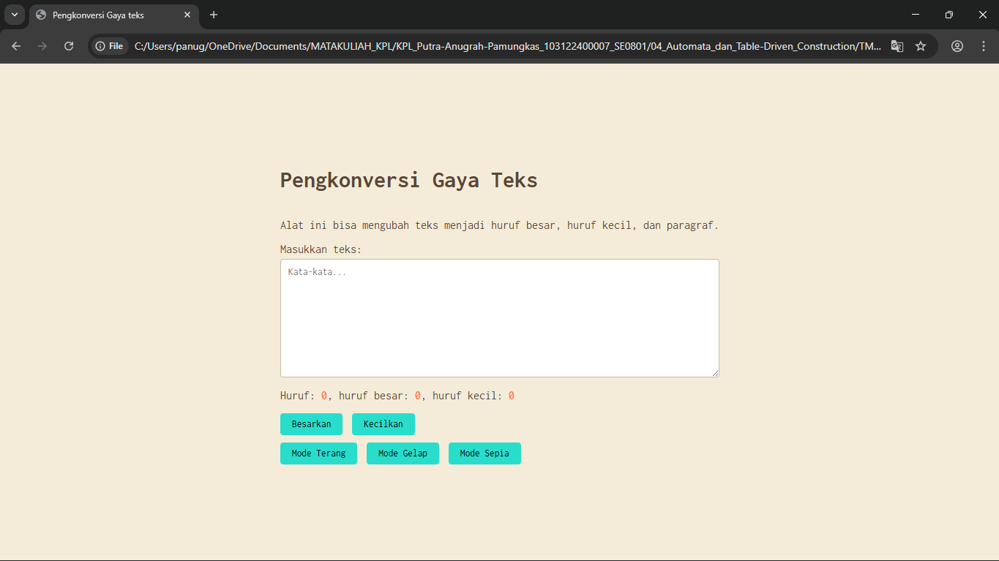

# Tugas Mandiri 04: Automata dan Table-Driven Construction

**Nama:** Putra Anugrah Pamungkas  
**NIM:** 103122400007   
**Kelas:** SE-08-01

## Tugas  
Tambahkan mode sepia dengan ketentuan:

Elemen	Warna
Latar belakang	#F4ECD8
Warna teks	#5B4636
Biarkan form tetap warna putih.

Ketentuan lainnya:

Bagian mode-div harus menaungi tiga button: light, dark, dan sepia
Bisa berpindah state secara mulus: sepia menghasilkan sepia-mode, dark menghasilkan dark-mode, dan light menghasilkan light-mode.

## Kode Sumber
Tersedia di [index.html](./index.html)
Tersedia di [index.css](./index.css)
Tersedia di [index.js](./index.js)

## Output

## Deskripsi Program
Program ini berfungsi untuk Menghitung Huruf/karakter secara langsung. Jadi ketika kita mengetik, programnya bakal langsung ngecek dan ngasih tau total karakternya ada berapa. Terus, dirinci lagi ada berapa jumlah huruf besarnya dan huruf kecilnya. Tombol Ubah Huruf menjadi besar dan kecil yang berfungsi buat langsung ngubah semua teks yang udah diketik jadi HURUF BESAR atau huruf kecil semua. Abis diklik, angka hitungan hurufnya juga otomatis langsung update. Ada juga tombol mode gelap dan tombol mode terang, dimana fungsi dari tombol mode gelap adalah mengubah warna backround menjadi warna hitam/gelap, mengubah warna teks menjadi putih(agar dapat terlihat ketika backround gelap) dan mengubah warna tombol menjadi hijau toska. Sedangkan tombol mode terang mengubah kembali ke setelan sebelumnya, yaitu backround terang, teks berwarna hitam, dan tombol berwarna hijau toska. tombol mode sepia berfungsi mengubah warna backround menjadi warna Light grayish orange dengan teks menjadi warna coklat serta warna tombol tetap menjadi warna hijau toska.