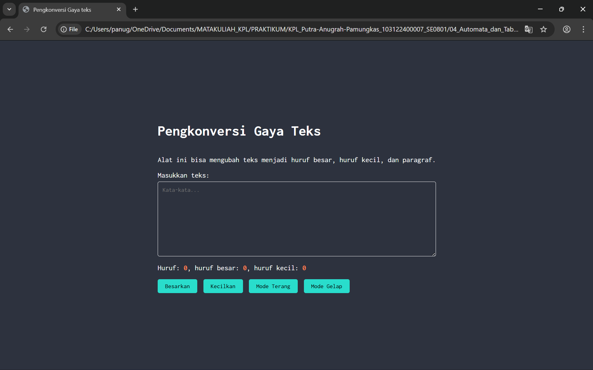
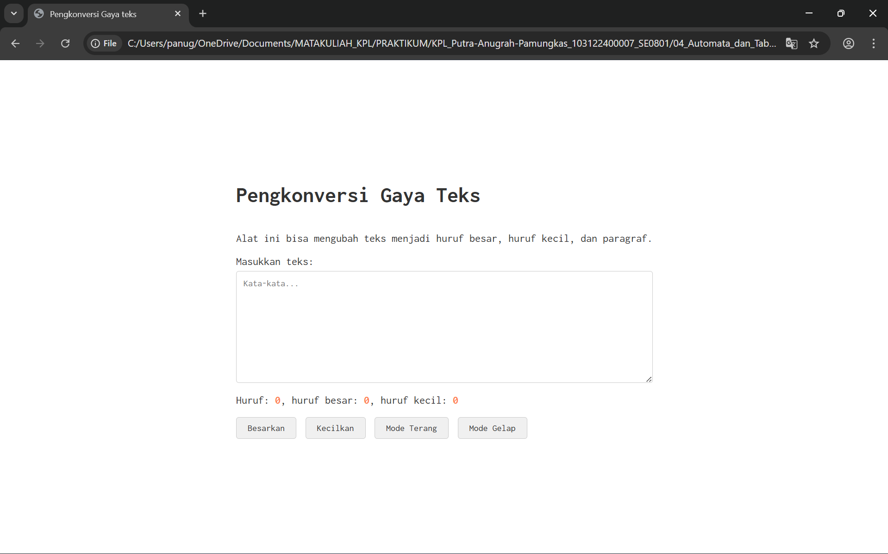

# Tugas Pendahuluan 04: Automata dan Table-Driven Construction

**Nama:** Putra Anugrah Pamungkas 
**NIM:** 103122400007 
**Kelas:** SE-08-01

## Tugas  
Tambahkan mode gelap sekaligus untuk editor-kecil dan tombol-tombolnya. Ketentuan warna untuk latar belakang editor-kecil adalah #2e3443, sementara untuk tombol adalah #29ddcc. Teks untuk tombol tetap mengikuti warna teks sebelumnya.

Untuk menghapus pinggiran tombol, nyatakan properti border untuk tidak ditunjukkan.

## Kode Sumber
Tersedia di [index.html](./index.html) 
Tersedia di [index.css](./index.css) 
Tersedia di [index.js](./index.js)

## Output

## Deskripsi Program
Program ini berfungsi untuk Ngitungin Huruf/karakter secara langsung. Jadi ketika kita mengetik, programnya bakal langsung ngecek dan ngasih tau total karakternya ada berapa. Terus, dirinci lagi ada berapa jumlah huruf besarnya dan huruf kecilnya. Tombol Ubah Huruf menjadi besar dan kecil yang berfungsi buat langsung ngubah semua teks yang udah diketik jadi HURUF BESAR atau huruf kecil semua. Abis diklik, angka hitungan hurufnya juga otomatis langsung update. Ada juga tombol mode gelap dan tombol mode terang, dimana fungsi dari tombol mode gelap adalah mengubah warna backround menjadi warna hitam/gelap, mengubah warna teks menjadi putih(agar dapat terlihat ketika backround gelap) dan mengubah warna tombol menjadi hijau toska. Sedangkan tombol mode terang mengubah kembali ke setelan sebelumnya, yaitu backround terang, teks berwarna hitam, dan tombol berwarna abu-abu.