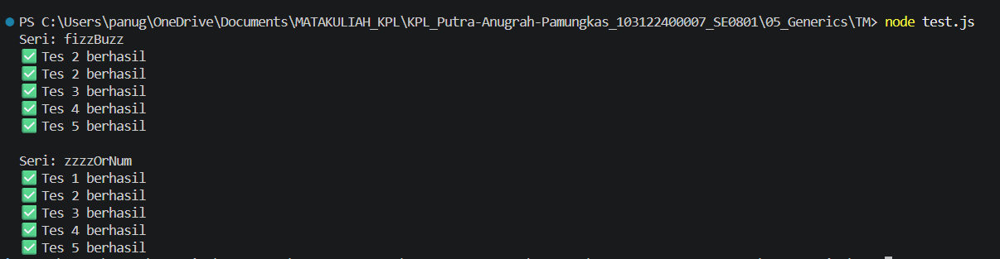

# Tugas Mandiri 05: Generics

**Nama:** Putra Anugrah Pamungkas 
**NIM:** 103122400007  
**Kelas:** SE-08-01

## Tugas
Membuat program index.js dengan Aturan FizzBuzz kali ini adalah:

Fungsi fizzBuzz hanya menerima larik yang semua elemennya terdiri dari bilangan bulat dan mengeluarkan larik pula yang bisa jadi bercampur string dan bilangan

Fungsi zzzzOrNum hanya menerima sebuah data tunggal berupa bilangan bulat dan mengembalikan "Fizz", "FizzBuzz", "Buzz", atau bilanga bulat sesuai logikanya

Kedua fungsi harus ada dan harus disertai JSDoc sesuai tipe data yang disiratkan dari no. 1, no. 2, dan perilaku yang diharapkan di bawah

fizzBuzz harus menggunakan fungsi zzzzOrNum di dalamnya

## Kode Sumber
Tersedia di [index.js](./index.js)
Tersedia di [test.js](./test.js)

## Output

## Deskripsi Program
Program ini adalah algoritma FizzBuzz yang terdiri dari dua fungsi bersarang dengan validasi tipe data dan anotasi JSDoc. Fungsi zzzzOrNum mengevaluasi angka tunggal menjadi teks "Fizz", "Buzz", "FizzBuzz", atau angka aslinya, sedangkan fungsi fizzBuzz memproses sebuah array bilangan bulat dengan memanfaatkan fungsi pertama untuk menghasilkan array baru. Jadi, kode ini dirancang agar tahan terhadap error dan mampu melewati pengujian test.js.